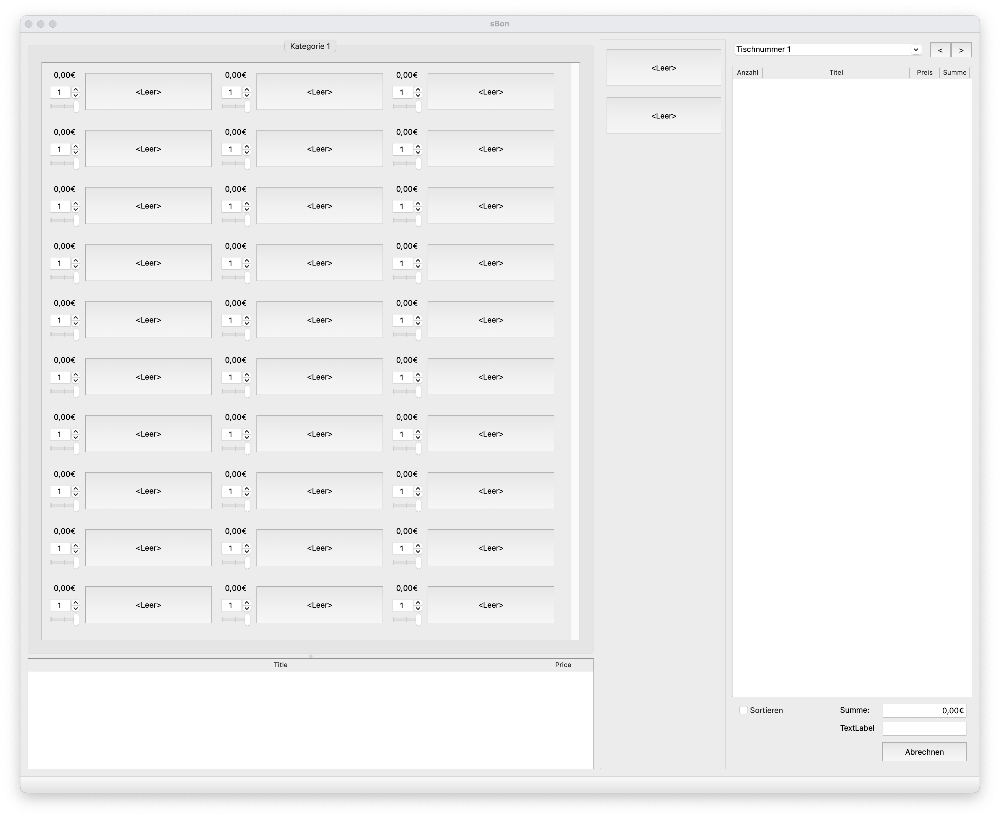

# sBon - Custom POS System

## Table of Contents
- [Installation](#installation)
- [Description](#description)
- [Screenshots](#screenshots)

## Description
This is a custom POS system for a local business. It is built using Qt, C++, and SQL Lite database. 
The goal is to create a simple, easy to use POS system that can be used by any business. It will be able to be customized to fit the needs of the business.
The main user interface constists of multiple buttons that can be assigned to different products. The different products can be added to the cart and then the cart can be checked out. The application is also able to print receipts and store the data in a database.
To serve multiple tables in a restaurant setting, different tables can be selected and the cart will be saved for that table. The cart can then be checked out and the table will be cleared.
In the lower part there is a section to add new products to the database, edit existing products, and delete products. This way updates to the restaurant menu can be made easily.

Currently the application is still in developmment, but a customized version of it is already being used in a local restaurant.

## Screenshots

The main user interface:
